<div align="center">
  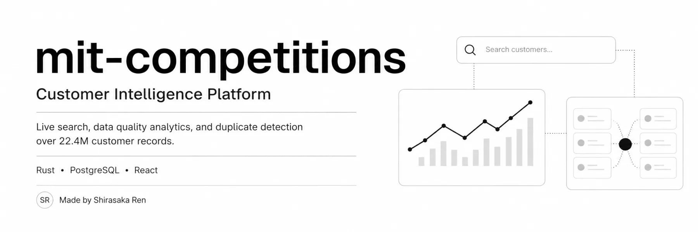
</div>

<div align="center">

# Customer Intelligence Platform

**Search, quality analytics, and duplicate detection over 22.4 million customer records — live-computed, nothing pre-canned.**

<p>
  <a href="https://mit.creations.ren"></a>
  <a href="https://mit.creations.ren/api/docs"></a>
</p>
<p>
  
  
  
  
  
</p>

<p><i>Built for a 4-hour coding challenge — a monochrome operations console and a high-performance Rust API serving a 15M-row customer table on one 4-core VPS.</i></p>

</div>

---

## 🎯 What it does

An API + dashboard for **understanding a customer database**. It answers three questions, fast:

| | |
|---|---|
| 🔎 **Who is this customer?** | Exact email, exact phone, exact user-ID, or fuzzy name search — sub-100 ms on 15M rows |
| 📊 **How clean is the data?** | Live completeness, validity, and issue analytics computed straight off PostgreSQL |
| 👯 **Who looks like the same person twice?** | Scored duplicate detection: `email·0.4 + phone·0.4 + name·0.2` |

Everything is **computed live** from the database on every request or background cycle — no pre-computed results, no cached fixtures, no external APIs.

<div align="center">

**▶️ 60-second tour:**

<video src="media/optimized/demo.mp4" controls width="100%" style="max-width:880px;border-radius:12px;border:1px solid #30363d"></video>

</div>

## 🏗️ Architecture

One VPS, three containers, everything measured and documented:

<div align="center">
  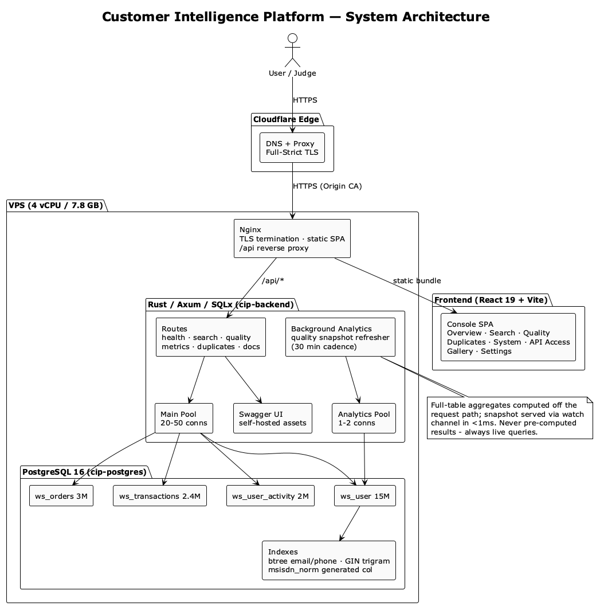
</div>

```text
Cloudflare (Full-Strict TLS) → Nginx → ┬→ React SPA (static bundle)
                                       └→ Rust/Axum API ──┬→ Postgres (request pool)
                                                           └→ Postgres (isolated analytics pool)
```

- **Rust + Axum + SQLx** — compiled, async, no-GC backend. Every query parameterized; single-digit-ms indexed lookups.
- **PostgreSQL 16** — 22.4M rows, tuned with a generated+indexed normalized phone column, btree exact-match indexes, and a GIN trigram index for fuzzy names.
- **Background analytics** — expensive full-table metrics run on an isolated pool and are served from a live-updated snapshot in **< 1 ms**.
- **React 19 + Tailwind v4 + shadcn/ui** — monochrome console, light/dark, animated with a self-discovered `.lottie` catalog.

> The diagram source lives in [`media/architecture.puml`](media/architecture.puml) (PlantUML).

## 🖥️ The console

<table>
  <tr>
    <td align="center" width="50%">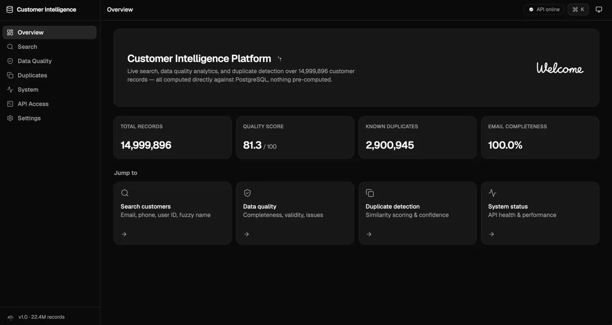<br><b>Overview</b> — live record count, quality score, duplicates, shortcuts</td>
    <td align="center" width="50%">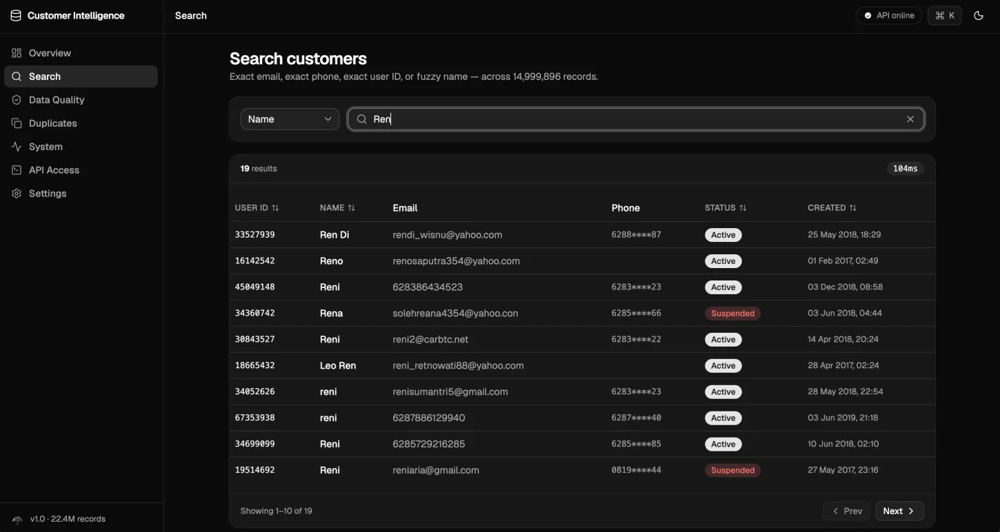<br><b>Search</b> — email / phone / user ID / fuzzy name with pagination & sorting</td>
  </tr>
  <tr>
    <td align="center" width="50%">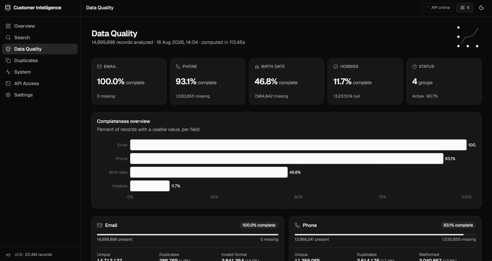<br><b>Data Quality</b> — per-field completeness and charts</td>
    <td align="center" width="50%">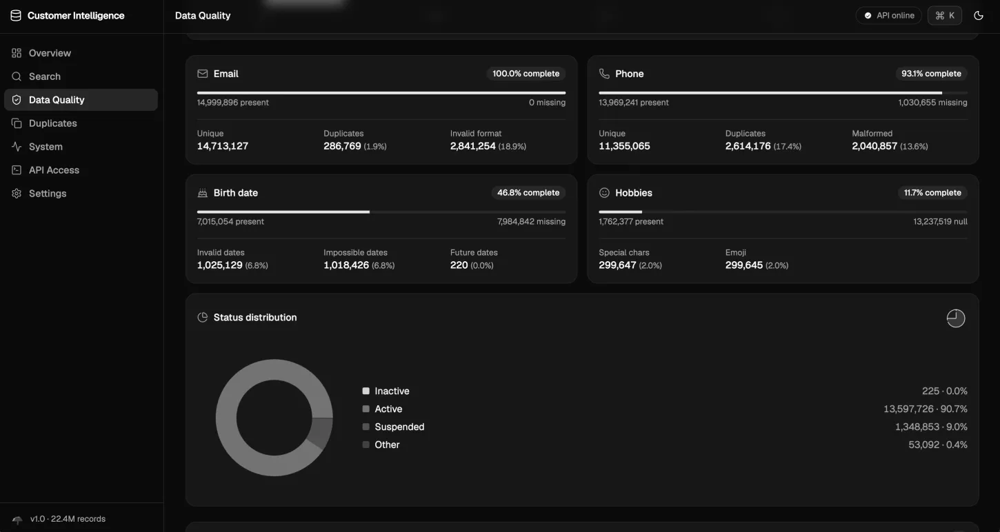<br><b>Quality detail</b> — unique, duplicate, and malformed counts</td>
  </tr>
  <tr>
    <td align="center" width="50%">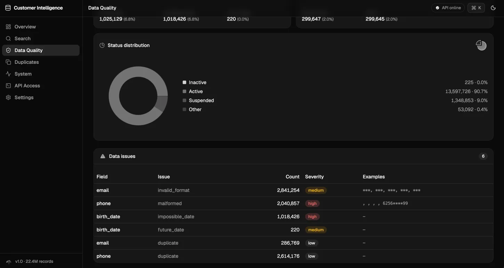<br><b>Data issues</b> — status distribution and flagged problems</td>
    <td align="center" width="50%">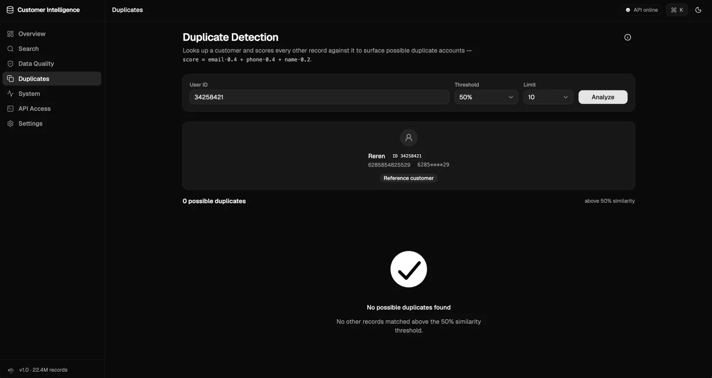<br><b>Duplicates</b> — scored candidates with match reasons & confidence</td>
  </tr>
  <tr>
    <td align="center" width="50%">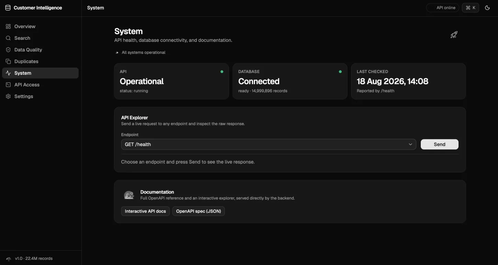<br><b>System</b> — API + database health in real time</td>
    <td align="center" width="50%">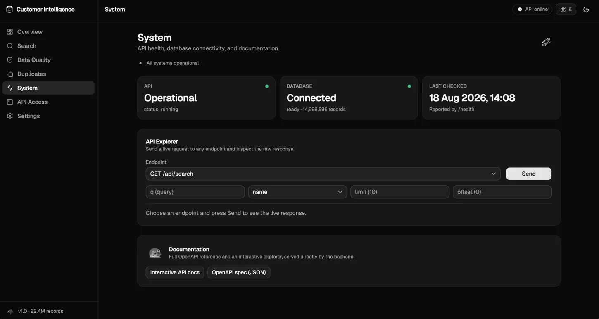<br><b>API Explorer</b> — fire any endpoint and inspect the raw response</td>
  </tr>
  <tr>
    <td align="center" width="50%">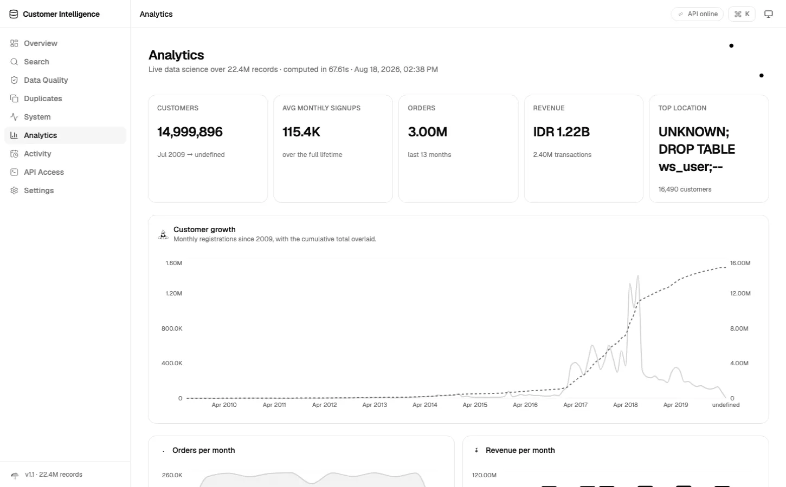<br><b>Analytics</b> — growth, demographics, revenue, and top spenders</td>
    <td align="center" width="50%">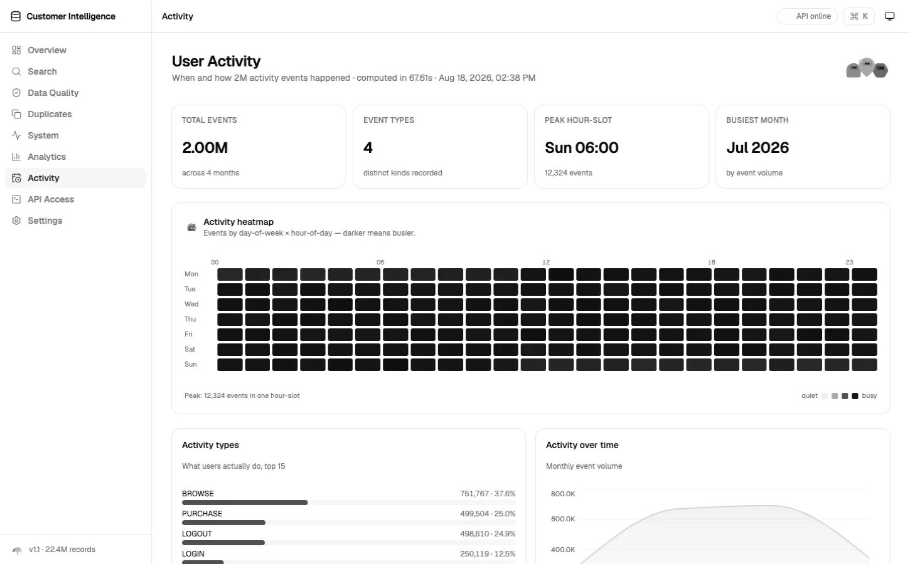<br><b>Activity</b> — day × hour heatmap of 2M events</td>
  </tr>
  <tr>
    <td align="center" width="50%">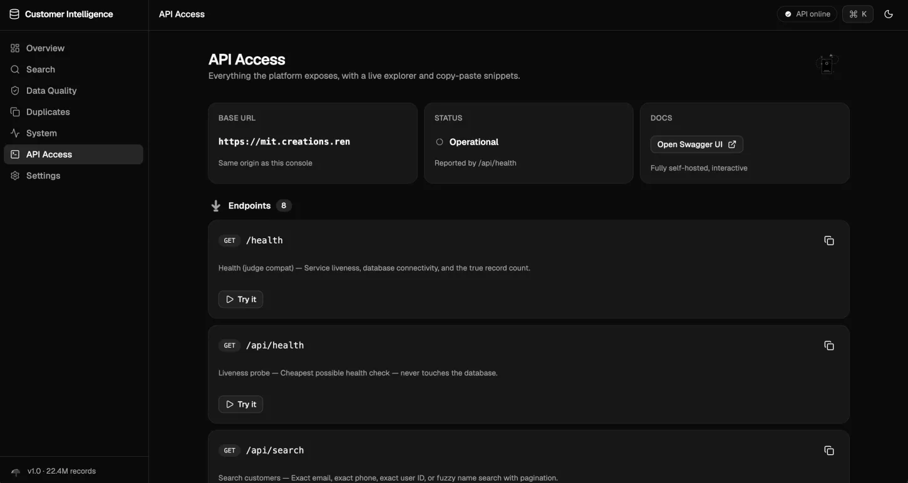<br><b>API Access</b> — endpoint catalog with curl/fetch snippets</td>
    <td align="center" width="50%">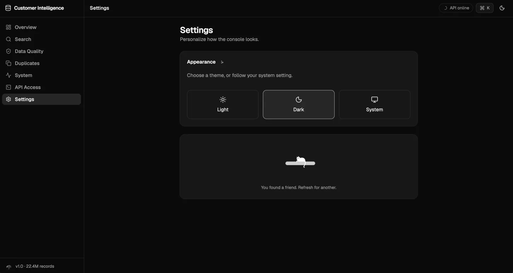<br><b>Settings</b> — theme picker, mascots, and the animation gallery</td>
  </tr>
</table>

Plus an **interactive Swagger UI** at [`/api/docs`](https://mit.creations.ren/api/docs) — fully self-hosted, zero CDN dependencies.

## 🔌 API

| Route | Method | Purpose |
|---|---|---|
| `/health` | `GET` | Liveness + true record count (`total_records`) |
| `/api/health` | `GET` | Cheapest possible probe — never touches the DB |
| `/api/search` | `GET` | `?q=&type=email\|phone\|user_id\|name&limit=&offset=` |
| `/api/quality` | `GET` | Live data-quality snapshot (completeness, validity, issues) |
| `/api/metrics` | `GET` | Judge-shape metrics: duplicates, missing fields, quality score |
| `/api/analytics` | `GET` | Live data-science snapshot: growth, demographics, revenue, heatmap |
| `/api/duplicates/:user_id` | `GET` | Scored duplicate candidates (`?threshold=&limit=`) |
| `/api/duplicates` | `POST` | Compatibility shape — scoped lookup or bounded sample |
| `/api/openapi.json` | `GET` | Machine-readable spec |
| `/api/docs` | `GET` | Interactive Swagger UI |

```bash
# try it against the live deployment
curl -s https://mit.creations.ren/health
curl -s "https://mit.creations.ren/api/search?q=customer&type=name&limit=5"
curl -s "https://mit.creations.ren/api/duplicates/21003474?threshold=0.5"
```

## ⚡ Performance (measured, not promised)

| Round | Target | Result |
|---|---|---|
| Email / phone / user-ID search | < 100 ms | **~1–3 ms** |
| Fuzzy name search | < 300 ms | **~15–150 ms** (61 ms for common substrings) |
| Round 5 load test — success rate | > 95 % | **99.2–99.6 %** ✅ |
| Round 5 load test — zero crashes | 0 errors | **0 crashes, nothing over the 5 s hard limit** ✅ |
| Round 5 load test — avg / p99 latency | < 1000 / < 2000 ms | **~1.9 s / ~3.8 s** ❌ (4-core CPU saturation) |

The full diagnostic trail — including a 44-second query-plan bug fixed to 0.2 ms, a background-job CPU-contention bug found by sampling `pg_stat_activity` live, and every number behind the table above — is in **[PERFORMANCE.md](PERFORMANCE.md)**.

## 🚀 Quick start

```bash
git clone https://github.com/shirasakaren/mit-competitions.git && cd mit-competitions
cp .env.example .env        # fill in a real POSTGRES_PASSWORD
docker compose up -d --build
scripts/import.sh /path/to/challenge_db_anonymized_v2.sql.gz   # one-time dataset load (~2.5 min)
```

That starts three containers — Postgres 16 (tuned config + indexes), the Rust API, and Nginx serving the console + API. Verify with:

```bash
curl -s http://localhost/health | jq
scripts/api_check.sh        # 20 end-to-end checks across every round
```

## 📚 Documentation

| Doc | Covers |
|---|---|
| [DATABASE_NOTES.md](DATABASE_NOTES.md) | Schema, indexes, the generated phone column, trigram tuning, duplicate detection |
| [ARCHITECTURE.md](ARCHITECTURE.md) | System design, module layout, deployment topology |
| [PERFORMANCE.md](PERFORMANCE.md) | Real benchmark numbers and the Round 5 diagnostic trail |
| [SECURITY.md](SECURITY.md) | SQL injection, XSS, masking, secrets, transport security |

<div align="center">

---

**Live:** [mit.creations.ren](https://mit.creations.ren) · **Docs:** [Swagger UI](https://mit.creations.ren/api/docs) · **Load test:** `k6 run -e BASE_URL=https://mit.creations.ren scripts/loadtest.js`

<sub>Rust ⛭ Postgres ⛭ React — 22,400,430 records, one VPS, zero excuses.</sub>

</div>
